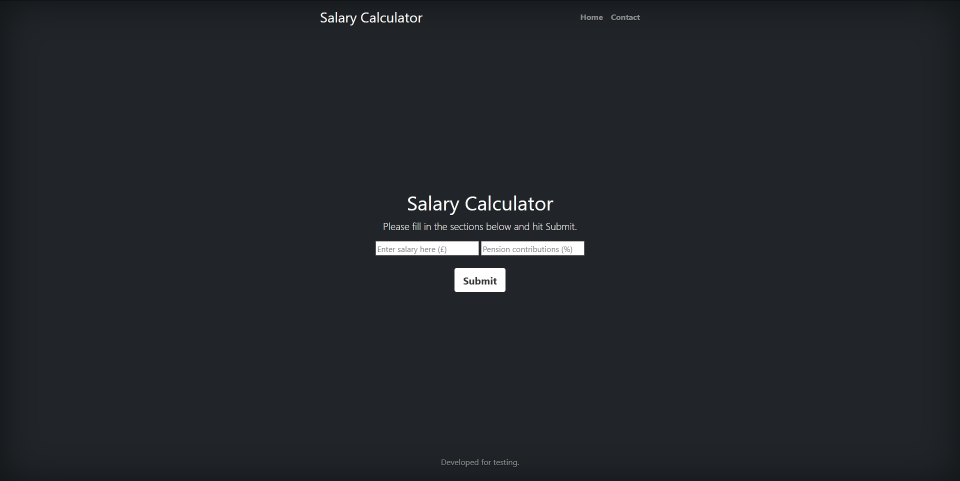
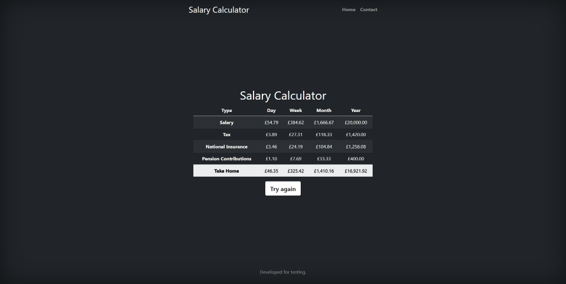

# Take Home Pay Calculator Web Application

A Flask web application containerised using Docker that calculates your take home pay for tax year 2020-21 based on salary and pension contributions as a percentage.

Other features include a Mongo database to record the number of times the application has been run as well as a Jenkins server for CI/CD.

Repository explained:

- app:
    - takehomepay: a python library to work out tax, pension and national insurance contributions
    - metrics: a python library to record how many times there has been a POST request from the application.
    - static: styling for the web application
    - templates: html webpages for the flask application
    - app.py: Flask application to run the application
- jenkins:
    - a jenkins project to explore using and automation server
- makefile
    - a file containing common commands with aliases
- ubuntu_vm_setup: bash script to install docker and prepare a VM to use this repository.

Instructions to run:
- Install Docker on your machine
- Clone this repository and run the following command
        
        make docker-run 

Alternatively, to run this on Ubuntu:
- Create Ubuntu VM using VMware
- Copy vm_setup.sh file to VM and run the following command to set up the environment and install Git/Docker.

    bash vm_setup.sh

- Clone repository (git clone url)
- make docker-run
- In order to review metrics:
    
        sudo docker exec -it <mongo_container_name> bash
        mongo
        show dbs
        use flask
        db.metrics.find()
        exit

Example images:

